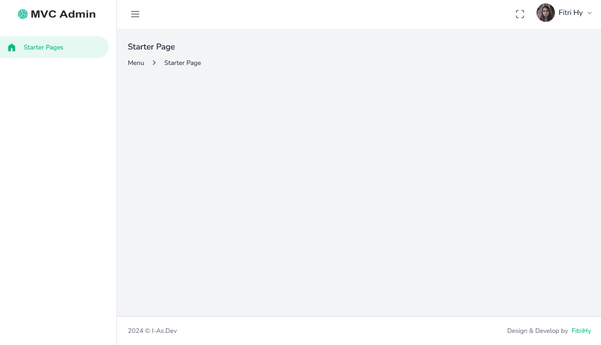
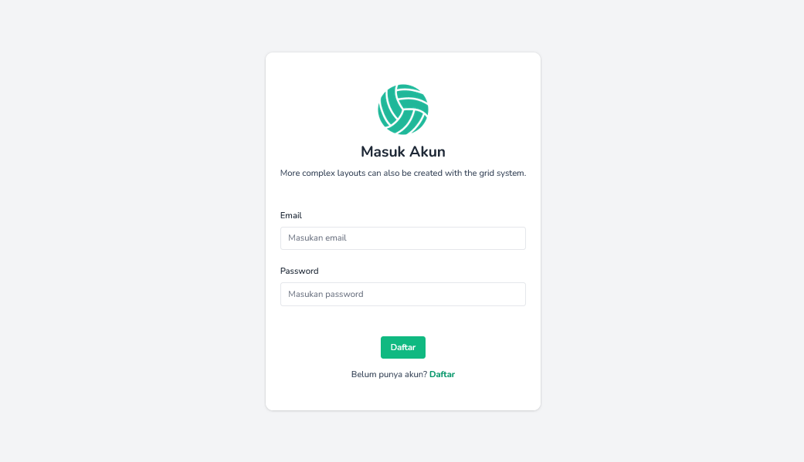
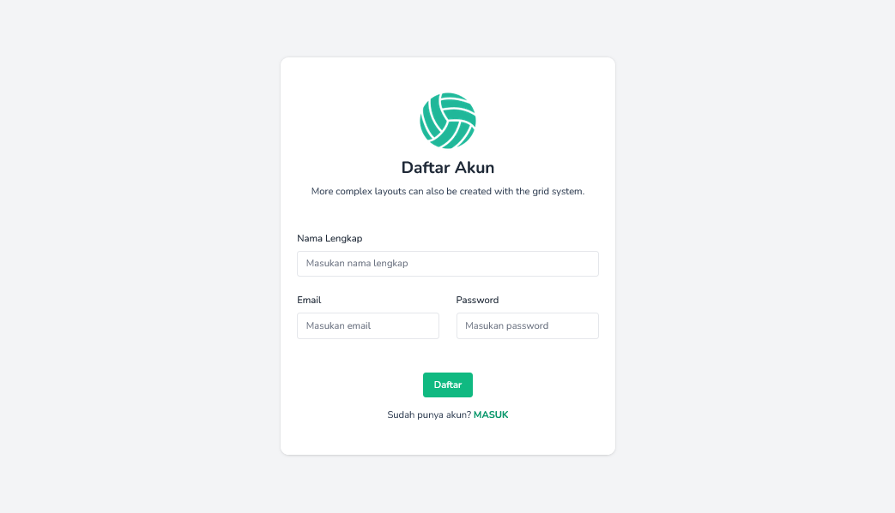

# PHP MVC Starter Template

Template dashboard PHP (MVC) with Tailwind CSS.





```
root/
├── app/
│   ├── controllers/
│   │   ├── AuthController.php
│   │   └── DashboardController.php
│   ├── models/
│   │   └── User.php
│   ├── views/
│   │   ├── components/
│   │   │   ├── footer.php
│   │   │   ├── header.php
│   │   │   └── menu.php
│   │   ├── partials/
│   │   ├── dashboard.php
│   │   ├── login.php
│   │   └── register.php
│   └── core/
│       ├── Router.php
│       ├── Controller.php
│       ├── Model.php
│       ├── Database.php
│       └── database.sql // import database mysql
├── public/
│   ├── assets/
│   └── index.php  // Enter start of application
└── .htaccess
```
